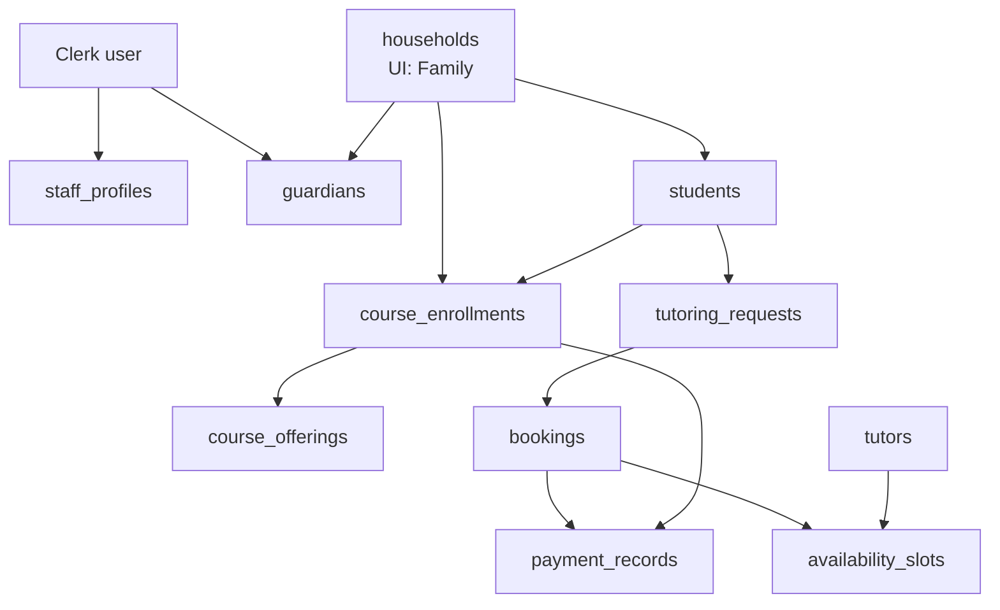

# Current architecture audit — Professional Tutoring app

**Date:** 19 August 2026  
**Repo:** `professional-tutoring-app`  
**Schema source:** `src/lib/db/schema.ts`

## Disclaimer

This is an **audit-only** snapshot of how the application works **today**. It is based on the current codebase and Drizzle schema. It does **not** change application code, schema, migrations, or integrations.

Do not treat UI labels, column names, or backlog wording as implemented behavior unless a file, table, route, or function is cited below.

Original investigation questions **1–8** are folded into sections **A–H**:

| Original question | Section |
|---|---|
| 1. Data model | A, E |
| 2. Create Family / Student flow | B (plus explicit table at end of B) |
| 3. Registration forms | B, C |
| 4. Zoho | D |
| 5. Tutor availability | E |
| 6. Acuity / Stripe / QuickBooks | F |
| 7. Functional vs mock lists | B, C |
| 8. Risks of a new Enrollment model | G |
| Unanswerable from code | H |

---

## A. Actual current architecture

**Family is `households`.** There is no `families` table.

**Tutoring** is `tutoring_requests` plus `bookings` on weekly `availability_slots`.

**SAT/ACT** is `course_enrollments` on `course_offerings`.

There is **no `sessions` table**. Staff “sessions” are derived UI rows.

**Zoho / Acuity / QuickBooks** do not sync. Stripe stores cards via SetupIntent; it does not charge.

### Diagram (actual implementation)

```text
                    ┌─────────────────────────────────────┐
                    │  Clerk user (auth only)             │
                    │  staff_profiles.clerk_user_id       │
                    │  guardians.clerk_user_id            │
                    └──────────────┬──────────────────────┘
                                   │
         ┌─────────────────────────┼─────────────────────────┐
         ▼                         ▼                         ▼
   staff_profiles            households                 (orphans)
                         (UI: "Family")            guardian/student
                         billing_owner_guardian_id     household_id NULL
                         stripe_customer_id
                         zoho_crm_id / zoho_crm_url
                         card_on_file, auto_charge
                                   │
                    ┌──────────────┼──────────────┐
                    ▼              ▼              ▼
               guardians       students      course_enrollments
               parent_1/2      lifecycle     (SAT/ACT path)
               is_billing_owner  zoho_deal_*     → course_offerings
               zoho_crm_*      student_subjects     capacity / enrolled_count
                                   │
                    ┌──────────────┴──────────────┐
                    ▼                             ▼
            tutoring_requests                 bookings
            (intake / request)                (seat claim)
            form_id, payload                  tutoring_request_id
            preferred_slot_id                 slot_id, seats_claimed
                    │                             │
                    └──────────────┬──────────────┘
                                   ▼
                          availability_slots
                          (weekly template: day_of_week + times)
                          capacity_seats, booked_seats, held_seats
                                   ▲
                                   │
                                tutors
                                max_seats_per_slot
                                tutor_subjects → subjects

payment_records.related_entity_type = "booking" | "course_enrollment"
price_snapshots  ←  quotes at book/enroll time
NO table: sessions | families | acuity_* | quickbooks_* | zoho sync log
```



### Real entities vs UI-only

Schema: `src/lib/db/schema.ts`.

| UI name | Database | Notes |
|---|---|---|
| Family | `households` | Not named `families` |
| Guardian | `guardians` | `household_id` nullable (orphan allowed) |
| Student | `students` | `household_id` nullable (orphan allowed) |
| Course / class | `course_offerings` | SAT/ACT cohort; `capacity` / `enrolled_count` |
| Enrollment | `course_enrollments` | **Courses only** — not tutoring |
| Tutoring request | `tutoring_requests` | Family/staff intake for 1:1 tutoring |
| Booking | `bookings` | Seat claim on a tutor slot; staff “session” detail reads this |
| Session | **No table** | Derived in `src/lib/staff/sessions-list.ts` (`buildStaffSessionRows`) |
| Open hours | `availability_slots` | Weekly recurring template (`day_of_week` + local times), not dated occurrences |
| Subjects | `subjects`, `tutor_subjects`, `student_subjects` | |
| Ledger | `payment_records` | Local; not Stripe charges |
| Policy / prices | `cancellation_policy_versions`, `price_books`, `price_book_lines`, `price_snapshots` | |

**UI-only / not tables:** “Family” as a table name, unified CRM “Enrollment”, “Session”, Acuity/QBO IDs, Zoho API client, Gravity Forms ingest, dated calendar occurrences.

### Foreign keys

**Present in Drizzle `.references()`:**

- `guardians.household_id` → `households.id`
- `students.household_id` → `households.id`
- `course_enrollments.course_offering_id` → `course_offerings.id`
- `tutor_subjects`, `student_subjects`
- notes, merge queue
- `price_book_lines.price_book_id`

**Columns exist but FKs are missing in Drizzle (no `.references()`):**

- `households.billing_owner_guardian_id`
- `availability_slots.tutor_id`
- almost all of `bookings`
- almost all of `tutoring_requests`
- `course_enrollments.household_id` / `student_id`
- `payment_records.household_id`

Integrity for those is **application-level**, not database-enforced.

### What the words mean in code

- **Enrollment** = `course_enrollments` only. Tutoring is **not** an enrollment.
- **Tutoring** = `tutoring_requests` + `bookings` against `availability_slots` (`form_id` `academic_year_tutoring` or `summer_tutoring`).
- **Booking** = one seat claim (`bookings.seats_claimed`, usually 1) on a weekly slot. Staff session detail is `GET/PATCH /api/staff/sessions/[id]` reading `bookings`.
- **Session** = derived UI row in `buildStaffSessionRows` (`src/lib/staff/sessions-list.ts`): open `bookings` + leftover seat rows (`id: seat:{slotId}`) + class rows (`id: class:{courseOfferingId}`). No persistence.
- **SAT/ACT course** = `course_offerings` codes `FIRST-CLASS-2026` / `EXPRESS-2026` / `SUMMER-MASTER-2026` mapped in `src/lib/enrollment/course-map.ts`, written as `course_enrollments`.

### Capacity (two models)

- Tutor seats: `availability_slots.capacity_seats` (default from `tutors.max_seats_per_slot` on create).
- Course seats: `course_offerings.capacity` vs `enrolled_count`.

These are not the same model.

### Migrations

`drizzle/0001`–`0021` are ALTERs on an existing base. There is **no `0000` create-all**. Base tables were mapped from an earlier DB (`MOCKUP-BACKLOG.md`: “Map existing Supabase tables”).

---

## B. What is already working

### People / family

- **Staff create family:** wizard `src/components/staff-new-family-wizard.tsx` → `POST /api/staff/families` inserts `households` + 1–2 `guardians` (`parent_1` / `parent_2`, `invite_token`) + optional `students` (name-only, `lifecycle: prospect`).
- **Duplicate search (advisory):** `GET/POST /api/staff/families/match` on guardian email + guardian/household phone. Create is **not** blocked.
- **Billing owner:** `guardians.is_billing_owner` + `households.billing_owner_guardian_id` (one owner; wizard forces a single Yes).
- **Add student to existing family:** `POST /api/staff/students` (`householdId` + `displayName`) from Students list (`?new=1&householdId=`). Family detail “Add new” routes there. Assign orphan/other: `POST /api/staff/families/[id]/students/assign`.
- **Family portal add student:** `AddStudentWizard` (`src/components/add-student-wizard.tsx`) → `POST /api/family/students` (fuller profile).
- **Enroll another course:** staff `StaffCreateEnrollmentModal` → `POST /api/staff/courses/[id]/enrollments`. Family `POST /api/family/enroll-courses` per offering. **No unique `(student, course)` constraint** — duplicates are possible.
- **Identity merge:** `identity_merge_requests` + `POST .../merge-queue/[id]/merge` moves guardians/students, archives source. **Does not move** `bookings` / `course_enrollments` / `payment_records`.
- **Invite:** `guardians.invite_token` + public `/invite/[token]` + `POST /api/invite/[token]` links `clerk_user_id`.
- **Self-serve signup:** `ensureFamilyGuardian` (`src/lib/auth/roles.ts`) creates pending `households` + billing `guardians` on first family login.
- **Onboarding unlock:** `POST /api/family/onboarding` sets `households.status = active`.

### Tutoring / courses / calendar

- **Family book:** `POST /api/family/book-tutoring` → `tutoring_requests` (`submitted`) + `bookings` (`pending_payment`) + `availability_slots.booked_seats + 1` + `payment_records` (`pending`).
- **Staff book:** `POST /api/staff/scheduling/bookings` → request `confirmed` + booking `confirmed` + `booked_seats + 1`.
- **Family enroll:** `POST /api/family/enroll-courses` → `course_enrollments` (`submitted`) + `course_offerings.enrolled_count + 1` + pending ledger.
- **Staff sessions week/list:** `GET /api/staff/sessions` from real bookings/slots/courses (`src/lib/staff/sessions-list.ts`).
- **Session attendance:** `PATCH /api/staff/sessions/[id]` on `bookings.attendance_status` (`present|absent|late|excused`).
- **Tutor open hours CRUD:** `GET/POST /api/staff/tutors/[id]/availability`. Live seat grid from real `bookings` occupants (`buildSlotSeats`).
- Subjects, tutors, courses, rosters: staff APIs persist.
- **Family calendar:** `GET /api/family/calendar` lists household bookings + enrollments.
- **Change requests:** `POST /api/family/change-requests` writes `change_requests`.
- **Support:** `support_cases` / `support_case_messages` both portals.
- **Reports:** seven queries over live tables (`src/lib/reports/run.ts`). Revenue explicitly “processor not posted”.
- **Settings policy/prices:** append-only versions; prices fall back to `SEED_PRICE_LINES` if `price_books` empty (`src/app/api/staff/settings/prices/route.ts`).
- **Stripe card-on-file:** `setupIntents.create` (`src/app/api/family/billing/setup-intent/route.ts`) + `confirm-method` + `resolveFamilyPaymentMethod` (`src/lib/family/resolve-payment-method.ts`). Requires env keys. **No charge.**

### Registration forms (working parts)

- **Public (unauthenticated):** Clerk `/sign-up`, `/sign-in`; invite accept. Not the five program forms.
- **Staff (authenticated POSTs):** new family / new student / add enrollment / add booking.
- **Family (authenticated POSTs):** onboarding, add student, book tutoring, enroll courses.
- **Per-program IDs:** five `FormId`s in `src/lib/forms/form-profiles.ts` (Gravity Form 16/11/5/3/35 hints). Two journeys: `book_tutoring` vs `enroll_courses`. This is **not** a Gravity Forms engine (`fieldsForForm` is deferred).
- **No public Gravity ingest** in this app. No inbound GF webhook.

### Create Family / Student flow (question 2, explicit)

| Step | Implemented? |
|---|---|
| Staff wizard Match → Household → Guardians → Students → Review | Yes |
| `POST /api/staff/families` | Yes |
| Guardians created | Yes (1 required, 2nd optional) |
| Duplicate detection | Search only; create not blocked; no unique email constraint in schema |
| Billing owner | Yes |
| Add student to existing family | Yes (`POST /api/staff/students` + assign) |
| Family portal add student | Yes (`POST /api/family/students`) |
| Enroll another course | Yes (staff modal + family enroll); **no unique constraint** |
| Public unauthenticated registration creating family/student | **No** (Clerk required except invite/health) |
| Gravity submit → DB | **No** |

---

## C. What is only partial / mock / placeholder

| Area | State | Evidence |
|---|---|---|
| Staff Home priority queue | If no payment issues, **sample rows** | `previewQueueRows`, `PREVIEW_REQUEST_TOTAL = 12` in `src/lib/staff/preview-requests.ts` / `src/app/staff/page.tsx` |
| `/staff/design-preview/*` | Static mock (sessions, tutor seats, login) | Masdouk-style grid is **preview only** (`src/components/staff-design-preview-tutor-seats-client.tsx`) |
| `/staff/requests/[id]` | Mix of live exceptions + samples | `preview-req-*` in preview-requests |
| Dashboard Fri–Sat | Capacity bars Sun–Thu only | Comment: Masdouk sheets (`src/app/staff/page.tsx`) |
| Family add student subjects | Written as `students.learning_needs` text | **Does not insert `student_subjects`** |
| Staff new-family students | Display name only | No grade/school/subjects |
| Match | Advisory only | Does not prevent create; no student-name duplicate check |
| `held_seats` | Column exists | **Never incremented** in app code (only read). Bookings bump `booked_seats` only |
| Recurring dated sessions | Not implemented | Slots are weekly templates; no occurrence table. Copy “One-time or recurring” in `src/components/family-student-detail.tsx` is UI |
| Express time slots | Catalog pending | `EXPRESS_TIME_SLOTS`; enroll API rejects preferences |
| Accommodations / 504 / rate packages / Parent2 Gravity dumps | Catalog `required: "pending"` | Not collected on wizards (`FORMS-CATALOG.md`) |
| Stripe charge | Ledger `pending` | No `paymentIntents.create`. Staff billing PATCH is local status/notes |
| `households.auto_charge` | Column + Gravity field | Not wired to a charge job |
| Zoho / Acuity / QBO | Status cards + optional ID/URL | No API client |
| Integrations tab | Status UI only | `IntegrationStatusPanel`: “Status only — does not charge, sync, or write outbound” (`src/components/staff-integrations-client.tsx`) |
| Merge | People only | Service/ledger stay on old `household_id` |
| Course vs slot capacity | Two counters | Can drift from cancelled rows if not decremented consistently |
| Public Gravity / website forms | Not in this app | Catalog maps fields conceptually only |

### Functional vs mock (question 7)

**Actually functional (DB-backed):** families/households, guardians, students, course enrollments, tutoring bookings, tutor availability CRUD + live seat grid, family calendar, change requests, support, reports (local tables), settings policy/prices, Stripe SetupIntent card-on-file, staff billing local ledger.

**Mock / placeholder:** staff home sample queue when empty, design-preview routes, Masdouk preview grid, Zoho/Acuity/QBO status cards, Stripe charges, Gravity ingest, dated session occurrences, `held_seats` holds.

---

## D. Zoho exact state

**Working vs placeholder: placeholder.** No Zoho SDK, env vars, webhooks, upsert, or outbound HTTP. Grep for `zoho.com` / `ZOHO_` in app code: empty.

### Files

- Schema: `src/lib/db/schema.ts` — `households.zoho_crm_id` / `zoho_crm_url`, `guardians.zoho_crm_id` / `zoho_crm_url`, `students.zoho_deal_id` / `zoho_deal_url`
- Migrations: `drizzle/0020_guardian_zoho_crm.sql`, `drizzle/0018_student_deal_notes_subjects.sql`
- UI: `src/components/staff-zoho-crm-fields.tsx`, `src/components/staff-record-integrations-card.tsx`
- PATCH: `src/app/api/staff/families/[id]`, `guardians/[id]`, `students/[id]`
- Settings: `src/components/staff-integrations-client.tsx` (“Not connected · Stage 4”)

**Six ID/URL columns.** Staff can paste values. Not written by sync.

### Modules / field maps / CRUD

- **Modules in code:** none. Labels only.
- **Field maps:** none. URL validated as `http(s)` on family/guardian PATCH.
- **CRUD / upsert / sync trigger / failure handling / webhooks:** not implemented.

### Believed mapping vs code

| Belief | Code |
|---|---|
| Family → Account | `households.zoho_crm_id` / `zoho_crm_url` — **storage only**, not Account API |
| Guardian → Contact | `guardians.zoho_crm_id` / `zoho_crm_url` — **storage only** |
| Student → Deal | `students.zoho_deal_id` / `zoho_deal_url` — **storage only**; naming matches Deal, no module calls |

`MOCKUP-BACKLOG.md` Stage 4: “Zoho sync” unchecked; Phase B/C: “live Zoho/Acuity/QBO writes” deferred.

---

## E. Tutoring / enrollment / booking / session logic

**Two products, two table paths.**

1. **1:1 tutoring:** `tutoring_requests` (intent: subject, window, plan, Gravity `form_id`, JSON `payload`) then `bookings` (operational seat). Family booking status starts `pending_payment` (card verified, **not charged**). Staff booking starts `confirmed`.
2. **SAT/ACT class:** `course_enrollments` on `course_offerings`. Preferences in `requested_slot_preference` + `notes` JSON (`formId`, `paymentPlanId`, `scheduleLabel`). Not tutor slots.

### Tutor availability (question 5)

- **Capacity per slot:** `availability_slots.capacity_seats`. Tutor `max_seats_per_slot` is the default for **new** hours and is patchable per slot. Not a global seat pool.
- **Bookings reduce capacity:** yes. `booked_seats + 1` and availability check `booked_seats + held_seats < capacity_seats`.
- **Seat assignment:** numbered seats are built **in memory** (`buildSlotSeats`). No `seat_assignment` table.
- **`held_seats`:** unused. Column exists; never incremented.
- **Recurring:** weekly templates (`day_of_week` + `start_time_local` / `end_time_local`). One booking occupies that template every week in the UI (sessions week reuses current week’s Sunday–Saturday labels). No series/exception dates.
- **Live grid:** DB-backed on tutor detail via `GET/POST /api/staff/tutors/[id]/availability` and real `bookings` occupants.
- **Masdouk:** comments and design-preview only (`src/app/staff/page.tsx` `WEEK_DAYS` 0–4; `src/components/staff-design-preview-tutor-seats-client.tsx`).
- **Real students vs mock:** live `students` on bookings. Design-preview seats (Maya Chen / Liam Park) and empty-queue preview names are fake.

**“Session”** is an alias for `bookings.id` in staff session routes. Class rows are `course_offerings`, not sessions.

---

## F. Acuity / Stripe / QuickBooks

| System | Classification | Evidence |
|---|---|---|
| **Stripe** | **Partial** | SetupIntent + customer + default payment method + brand/last4 (`src/lib/stripe/client.ts`, `src/app/api/family/billing/setup-intent/route.ts`, confirm-method). No `paymentIntents.create`, no webhooks, no receipts from processor. Ledger is local `payment_records`. |
| **Acuity** | **UI placeholder / not implemented** | Integrations card only. `StaffRecordIntegrationsCard` has `acuityId` / `acuityUrl` props; **no schema columns**, never passed. |
| **QuickBooks** | **UI placeholder / not implemented** | Same as Acuity. Revenue report hardcodes “QBO not posted” (`src/lib/reports/queries/revenue.ts`). |
| **Zoho** | **Connected unused** (IDs) / **not connected** (API) | Manual ID/URL; no client. |

**Billing screen:** real **local ledger** (`GET /api/staff/billing`, family `GET /api/family/payments`). Staff can PATCH status/notes (`src/app/api/staff/billing/[id]/route.ts`). Not a Stripe Dashboard, not charges. Family status copy: “Awaiting charge”.

No Acuity/QBO write paths exist (audit did not call them).

---

## G. Risks of changing architecture (new Enrollment model)

**Overlap today:** “Enrollment” already means `course_enrollments`. Tutoring is `tutoring_requests` + `bookings`. A unified Enrollment that covers both will collide with:

- names
- APIs (`/enroll-courses`, `/book-tutoring`)
- payments (`payment_records.related_entity_type`)
- reports
- calendar `kind: booking | enrollment`
- staff family “Course enrollments” vs “Bookings”

### Preserve vs rebuild

| Keep (working) | Rebuild / wrap carefully |
|---|---|
| `households` / `guardians` / `students` | Do not rename Family table without a view |
| Split tutoring vs SAT/ACT | Unify only with a discriminator — do not stuff tutoring into `course_enrollments` |
| Weekly `availability_slots` + `booked_seats` | Dated occurrences / holds (`held_seats` unused) |
| `price_snapshots` at request time | Charge pipeline (does not exist) |
| Zoho ID columns | Sync job; mapping is naming-only |

### Concrete hazards

- Merge already leaves bookings/enrollments on source `household_id`.
- No unique student + course.
- Family student subjects vs `student_subjects` diverge.
- `enrolled_count` is a denormalized counter.
- Session UI mixes three row types (`booking`, `seat:{slotId}`, `class:{courseOfferingId}`).
- Clerk self-signup can create a **second** household if invite isn’t used (`ensureFamilyGuardian` vs staff-created invite).

**Recommendation:** keep two service lines. Add a thin `Enrollment` (or CRM Deal) **above** them only if Zoho Deal must be one object. Do not collapse `bookings` into `course_enrollments`.

---

## H. Questions the codebase cannot answer

- Whether production Postgres has all `drizzle/0001`–`0021` applied (no `0000`; this audit did not query the DB).
- Live Stripe / Zoho / Acuity / QBO account linkage beyond env keys and pasted IDs.
- Whether website Gravity Forms still write anywhere (WordPress); this repo has no inbound GF webhook.
- Intended Zoho module/field IDs (Account / Contact / Deal) beyond column names.
- How a weekly slot booking maps to real calendar dates / cancellations of a single week.
- Who occupies seat N vs N+1 over time (grid is an occupancy snapshot, not assigned seat IDs).
- Best Fit / school merge (`MOCKUP-BACKLOG.md` still open).
- Whether `auto_charge` should charge monthly plans.
- Clerk Dashboard custom fields (app only mounts default `SignUp` / `SignIn`).
- Whether duplicate family create after a match is ops-intended or a gap.
